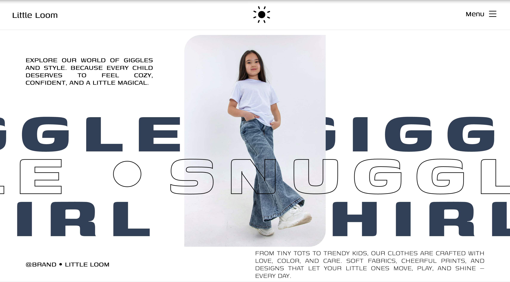

# Little Loom

A playful and modern landing page for a kidswear brand — bringing together fun typography, soft visuals, and responsive design to create a joyful digital space.

---

## ✨ Features

- Bold and playful type design  
- Responsive and mobile-friendly layout  
- High-res visuals with brand-driven storytelling  
- Built using HTML, CSS, and JavaScript  

---

## 🔗 Live Preview

- [View Website](https://milanxcode.github.io/Little-Loom/)  

---

## 🛠 Tech Stack

- HTML5  
- CSS3  
- JavaScript  

---

## 📸 Screenshots

---

## 💡 Inspiration

Inspired by giggles, playtime, and the cozy charm of childhood — this project celebrates cheerful design with care and creativity.

